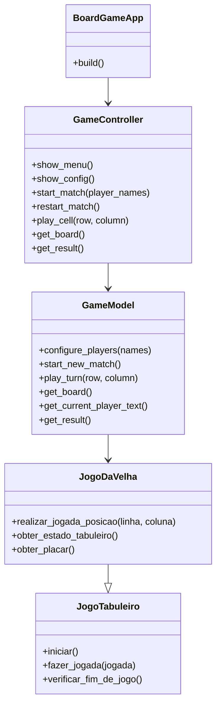

# Grupo
-Marcus Vinícius Milan da Silva
-Felipe Savegnago Pires
-Carlos Chen

# Jogo da Velha com Python, POO e KivyMD

Este projeto foi desenvolvido para a disciplina de Programacao Orientada a
Objetos. A ideia principal foi criar um jogo de tabuleiro usando Python,
aplicando os conceitos vistos em aula, como classes, objetos, heranca,
encapsulamento, composicao e separacao de responsabilidades.

O jogo escolhido para a interface grafica foi o Jogo da Velha, porque ele
permite trabalhar bem com regras, turnos, jogadores, tabuleiro, vitoria e
empate sem deixar o projeto grande demais.

## Sobre o desenvolvimento

Durante o projeto, uma das maiores dificuldades foi separar corretamente a
logica do jogo da parte visual. No comeco, era mais simples pensar em colocar
tudo junto, mas isso deixaria o codigo mais dificil de manter. Por isso, foi
usado o padrao MVC, separando Model, View e Controller.

Tambem foi um desafio aprender a trabalhar com KivyMD e com arquivos `.kv`.
Como esse tipo de arquivo foi introduzido recentemente, precisei entender como
ele se conecta com as classes Python, como funcionam os `ids`, os botoes, as
telas e o `ScreenManager`. A parte visual exige uma forma diferente de pensar,
principalmente porque a interface precisa atualizar depois de cada jogada.

Para auxiliar em problemas repetitivos e em duvidas durante o desenvolvimento,
foi utilizada a IA Claude. Ela ajudou principalmente com organizacao de codigo,
correcao de erros simples, ideias para estruturar melhor as classes e pequenos
ajustes na interface. Mesmo assim, a proposta do projeto foi estudar o codigo e
entender como cada parte funciona dentro da arquitetura orientada a objetos.

## Como executar

Na raiz do projeto, instale as dependencias:

```bash
pip install -r requirements.txt
```

Depois execute a interface grafica:

```bash
py main.py
```

Tambem existe uma versao antiga em terminal:

```bash
py -m src.main
```

## Testes

Para rodar os testes:

```bash
py -m pytest -v
```

## Estrutura do projeto

```text
main.py
app/
 ├── models/
 ├── views/
 ├── controllers/
 └── components/
assets/
src/
 ├── core/
 └── jogos/
tests/
README.md
requirements.txt
```

## Arquitetura MVC

O projeto usa MVC para deixar o codigo mais organizado:

- Model: fica em `app/models/game_model.py` e representa os dados e a partida.
- View: fica em `app/views/` e cuida das telas em KivyMD e do arquivo `.kv`.
- Controller: fica em `app/controllers/game_controller.py` e faz a ligacao
  entre a interface e a logica do jogo.
- Core do jogo: fica em `src/core` e `src/jogos`, onde estao as classes mais
  ligadas a Programacao Orientada a Objetos.

A View nao acessa diretamente os atributos internos do jogo. Ela chama o
Controller, e o Controller chama metodos publicos do Model. Isso foi feito para
evitar misturar interface grafica com regra de negocio.

## Telas implementadas

- Menu Principal: mostra o nome do jogo e as opcoes principais.
- Configuracao de Partida: permite informar o nome dos jogadores.
- Tabuleiro: mostra o jogo, o jogador da vez, o placar e as jogadas.
- Resultado: mostra vencedor ou empate, estatisticas e opcao de nova partida.

## Componentes usados

Foram usados componentes do KivyMD, como:

- `MDApp`
- `ScreenManager`
- `MDTopAppBar`
- `MDCard`
- `MDRaisedButton`
- `MDDialog`
- `MDLabel`
- `MDIcon`
- `GridLayout`

## Principais conceitos de POO aplicados

- Abstracao: classes como `JogoTabuleiro` representam uma ideia geral de jogo.
- Heranca: `JogoDaVelha` herda de `JogoTabuleiro`.
- Encapsulamento: atributos internos ficam protegidos e sao acessados por
  metodos publicos.
- Polimorfismo: cada jogo pode implementar suas regras de forma propria.
- Composicao: o jogo possui tabuleiro, jogadores, pecas, regras e historico.

## UML simplificada



## Conclusao

Esse trabalho ajudou a entender melhor como a Programacao Orientada a Objetos
pode deixar um projeto mais organizado. Tambem mostrou que criar uma interface
grafica com KivyMD e arquivos `.kv` exige cuidado, porque a tela precisa estar
bem separada da logica. Apesar das dificuldades, o projeto ficou funcional e
permite iniciar, jogar, detectar vencedor ou empate e reiniciar uma partida.
